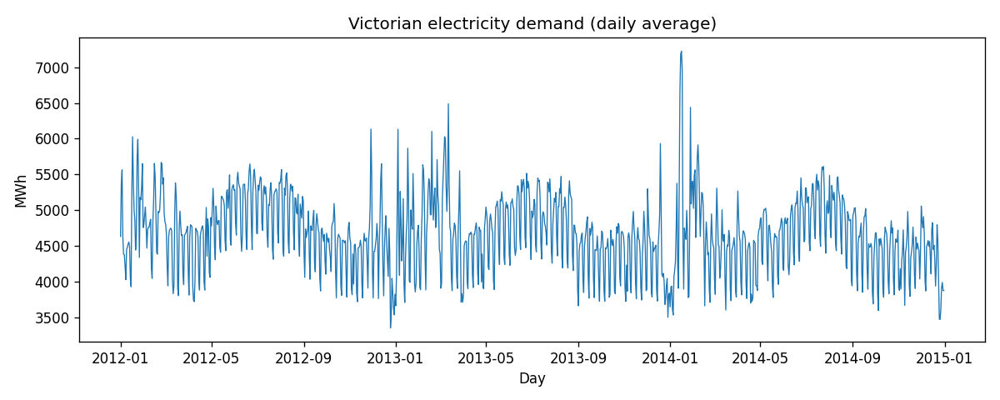

# tablecloth.time


[](https://clojars.org/org.scicloj/tablecloth.time)
[](https://github.com/scicloj/tablecloth.time/actions/workflows/cd.yml)


## Description

This library offers tools for manipulating and processing time-series
data. It complements and extends the API provided by
[`tablecloth`](https://github.com/scicloj/tablecloth) for working with
the highly performant columnar datasets of
[`tech.ml.dataset`](https://github.com/techascent/tech.ml.dataset).

**Status:** Under active development. The API may change.

## Design Philosophy

This library is experimental and has evolved since its inception. The current approach favors **composability over high-level abstraction**.

In practice, this means we do not store metadata on the dataset indicating which column contains temporal data. Rather than providing functions like `adjust-frequency` that implicitly operate on a designated time index, we provide primitives like `add-time-columns` that make it easy to derive temporal fields explicitly. Users then compose these with standard tablecloth operations (`group-by`, `aggregate`, etc.).

Previous versions implemented index-aware functions built on a now-removed indexing mechanism in `tech.ml.dataset`. A future version of this library may reintroduce an optional mechanism for designating a temporal index, but for now we prioritize explicit column arguments and composable primitives.

## Usage

```clojure
(require '[tablecloth.api :as tc]
         '[tablecloth.time.api :as tct]
         '[tablecloth.time.column.api :as tct-col])

;; Add temporal fields to a dataset
(-> my-dataset
    (tct/add-time-columns :timestamp {:year "Year" 
                                      :month "Month"
                                      :day-of-week "DayOfWeek"}))

;; Slice a time range
(-> my-dataset
    (tc/order-by :timestamp)
    (tct/slice :timestamp #time/date "2024-01-01" #time/date "2024-03-31"))

;; Add lag columns for time series analysis
(-> my-dataset
    (tct/add-lags :price [1 2 3 4]))

;; Column-level operations
(tct-col/year (my-dataset :timestamp))        ; extract year
(tct-col/floor-to-month (my-dataset :timestamp))  ; truncate to month
```

### Resampling Example

Resample half-hourly electricity data to daily averages — no magic, just composable primitives:

```clojure
;; Load half-hourly Victorian electricity data
(def vic-elec (tc/dataset "data/fpp3/vic_elec.csv" {:key-fn keyword}))

;; Resample to daily averages:
;; 1. Extract date from datetime using add-time-columns
;; 2. Group and aggregate with standard tablecloth
(-> vic-elec
    (tct/add-time-columns :Time {:date-string "Day"})
    (tc/group-by ["Day"])
    (tc/mean :Demand))
```

The philosophy: `add-time-columns` extracts temporal components you need, then standard tablecloth does the rest. Explicit columns throughout — no implicit index, no magic.



See `notebooks/chapter_02_time_series_graphics.clj` for more examples based on
[Forecasting: Principles and Practice](https://otexts.com/fpp3/).

## Development

We use a "hybrid" Leinigen/tools.deps setup. You can use either `lein`
or `clj/clojure`. We chose this hybrid setup so that we get the
benefits of Leinigen's suite of build-related tools, while also
benefitting from the simplicity of tools.deps' approach to
dependencies. For more context on the differences and trade-offs
between the the two, see [this
post](https://clojureverse.org/t/is-there-a-sales-pitch-for-switching-to-deps-edn-from-lein-in-2020/5367/5).

#### Linting

We use both `cljfmt` and `clj-kondo` to lint our code. To run the linters, do:
```bash
lein lint
```

#### Tests

We run tests using the `midje` test runner, which will run both any midje tests
and any standard clojure tests:
```bash
lein midje
```

## Contributing

Development for this project happens in the SciCloj [fundamentals
study
group](https://scicloj.github.io/pages/web_meetings/#sci-fu_group), a
group focused on improving the Cojure datascience ecosystem. We tend
to hang out in the
[\#sci-fu](https://clojurians.zulipchat.com/#narrow/stream/265544-sci-fu)
stream on the Clojurians Zulip, and we meet regularly to coordinate,
learn, and solve problems.

We eagerly invite your participation in this project. The project is currently in an experimental phase and we are approaching its development interactively as a group in a way that is driven by openness and learning. If you are interested, please reach out.

Please peruse this project's [issues](https://github.com/scicloj/tablecloth.time/issues) to get a sense of work that is ongoing for this project.

## License

MIT for now, but this is basically a placeholder.  Open to suggestions.
